# Icy-Tower-game
Languages used : C++ with SFML library.
A game where the user aims to get the highest score by jumping over blocks and trying not to miss or fall. The player’s
speed increases over time for additional game complexity. The game has and option of multiplayers, where two users can 
play and compete.
College project for structured programming course.

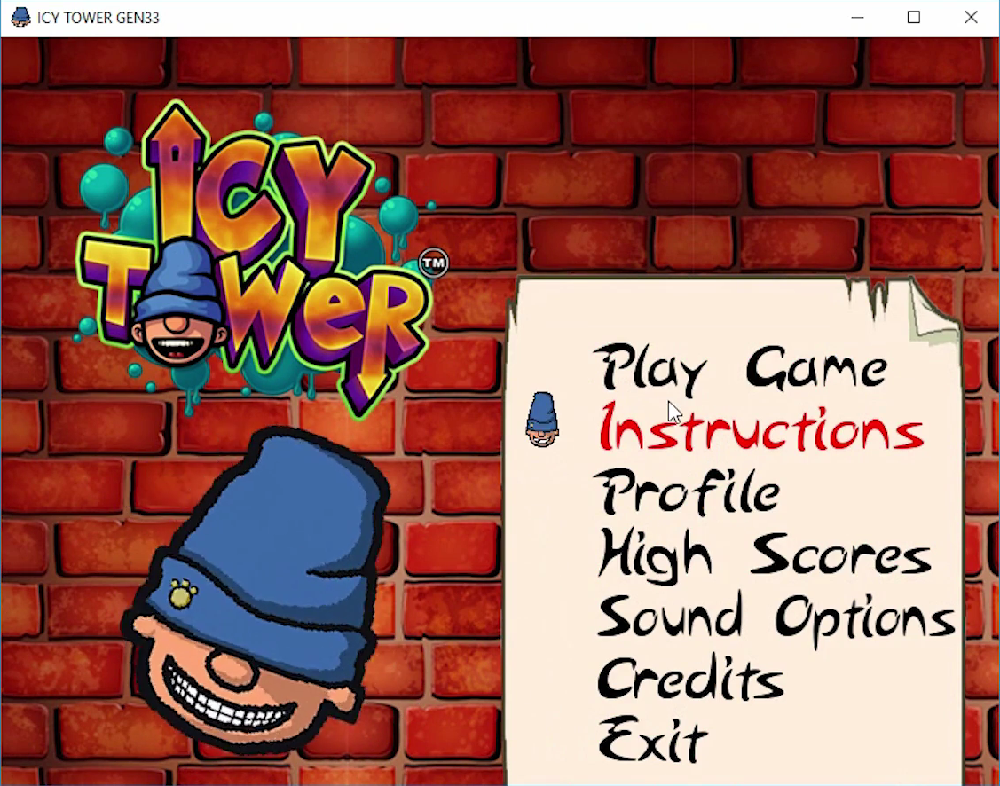

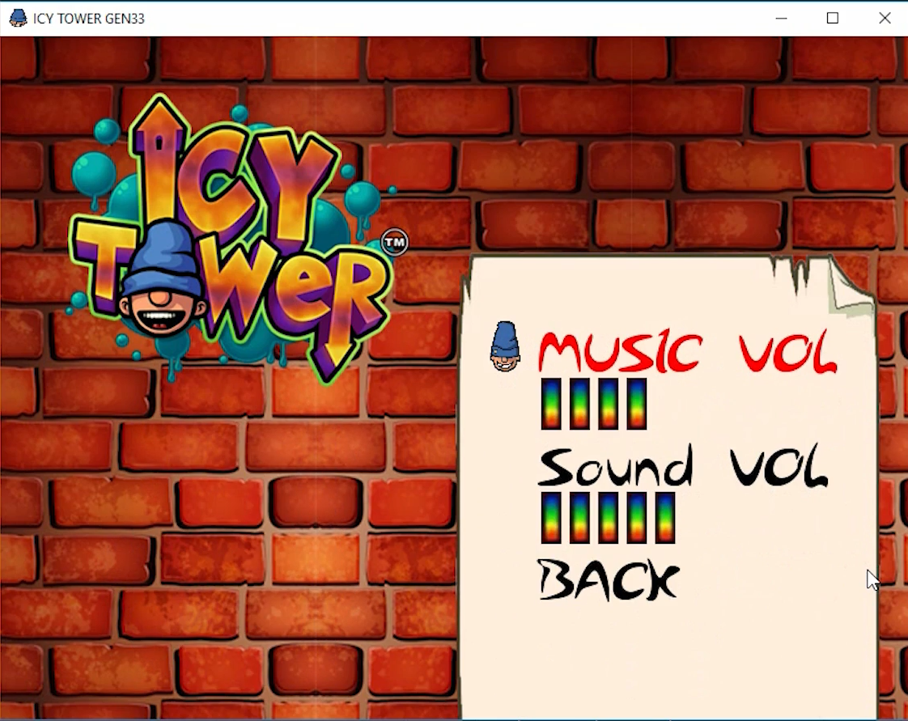

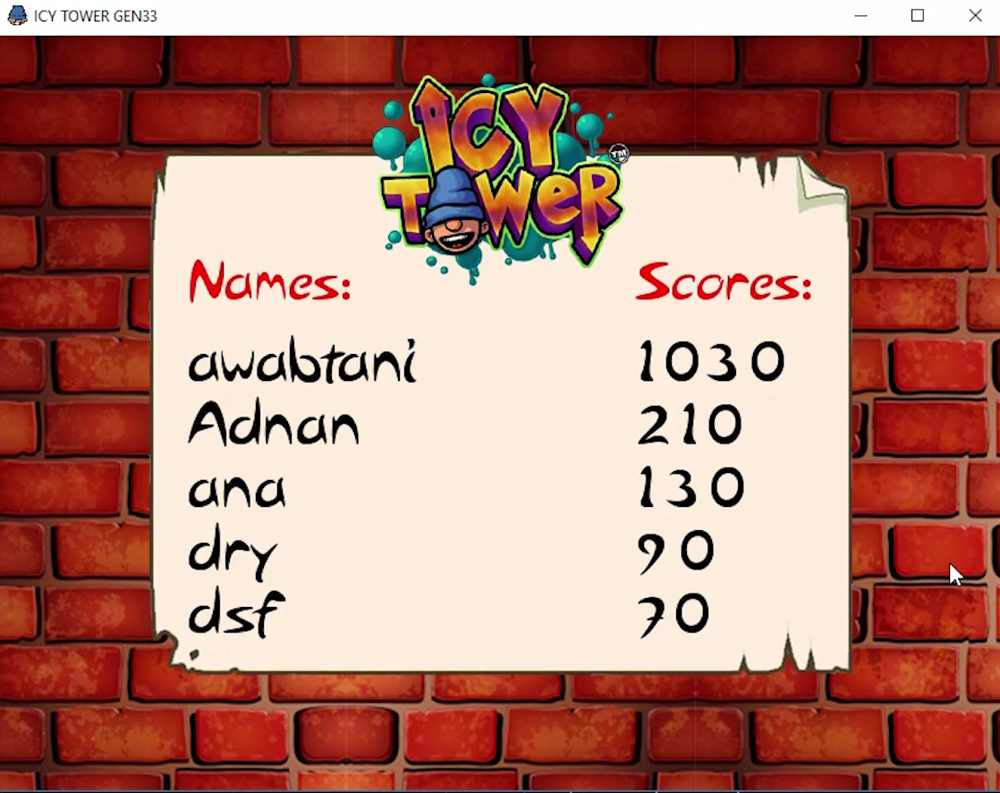

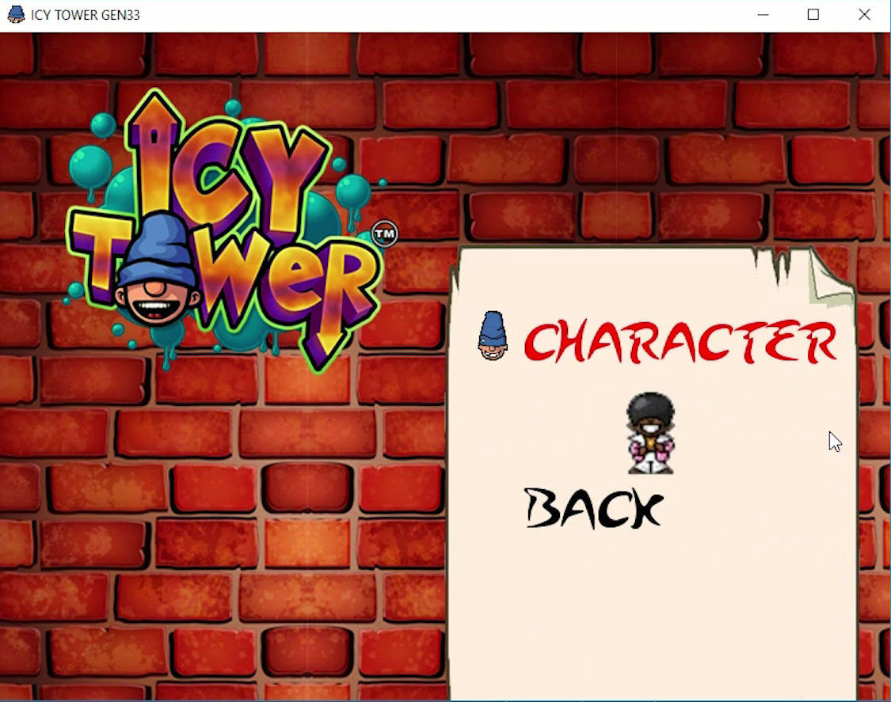

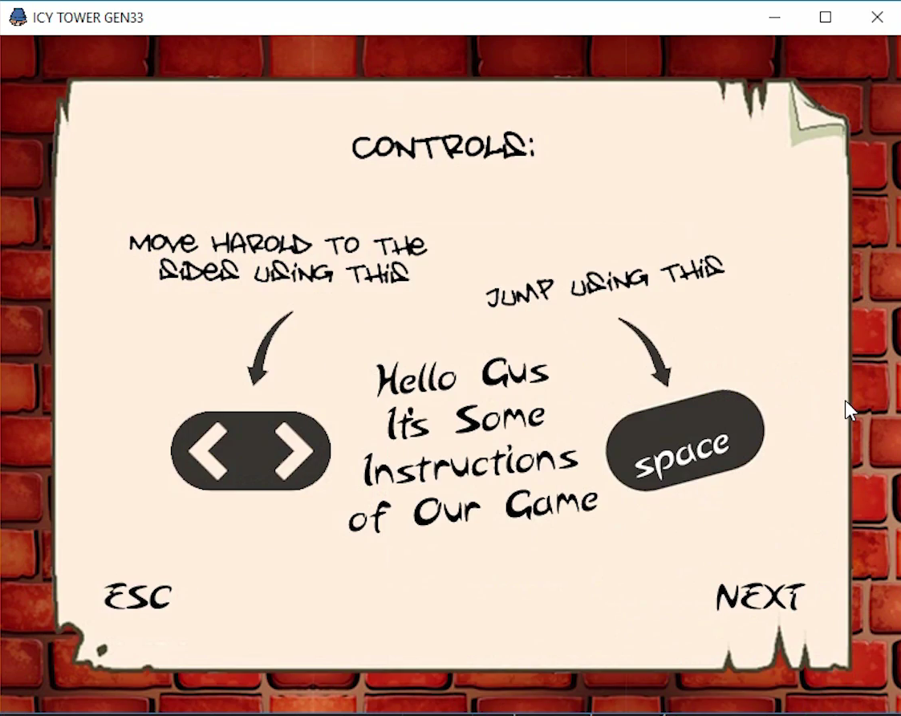

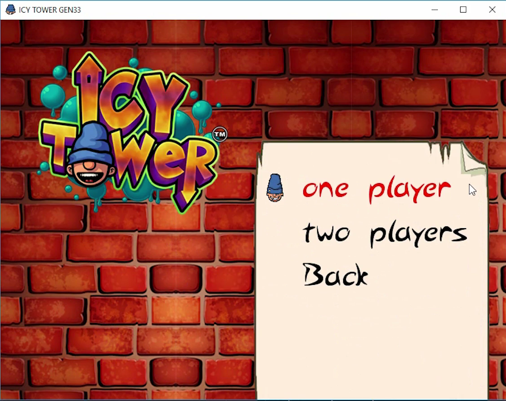

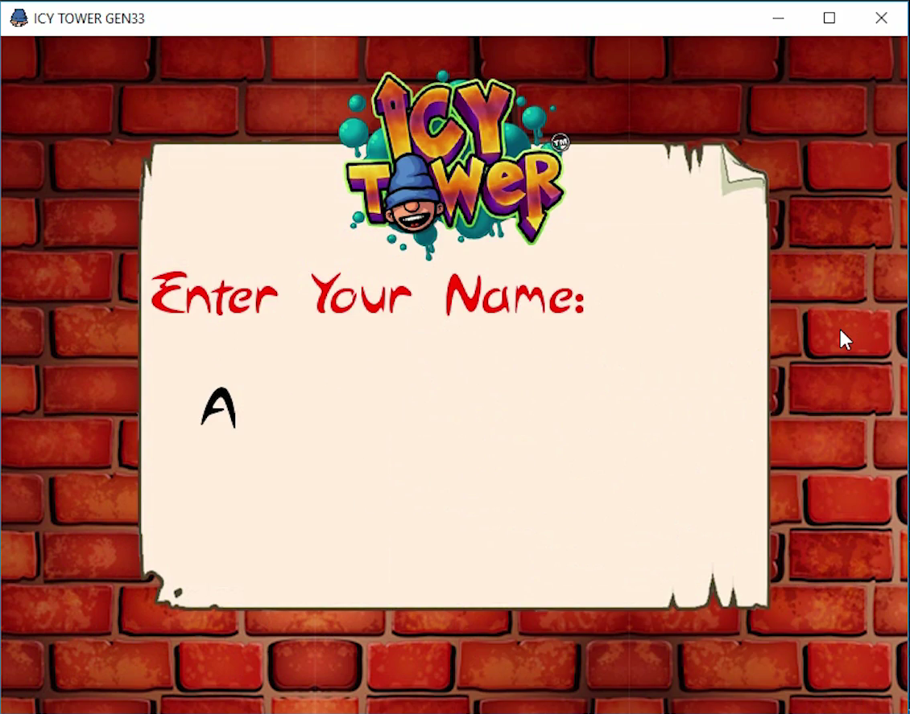

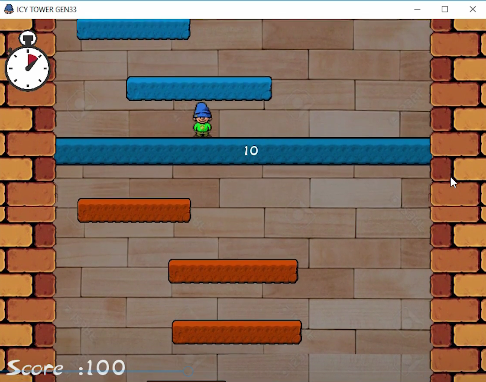

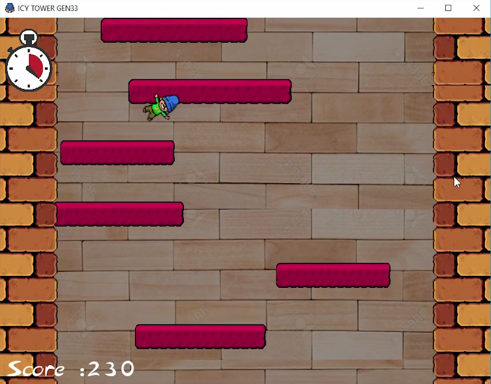

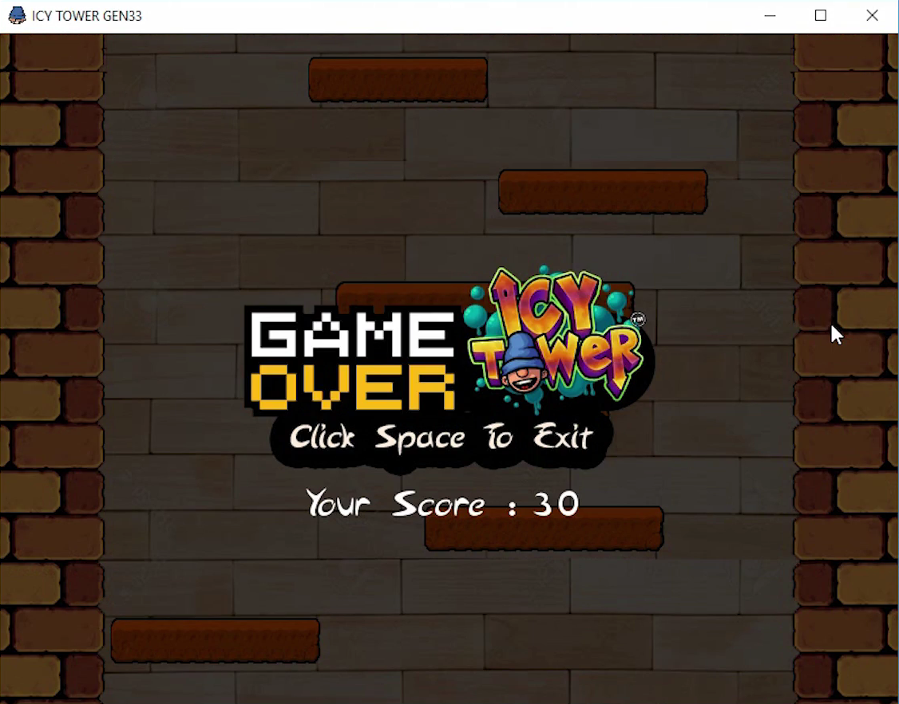

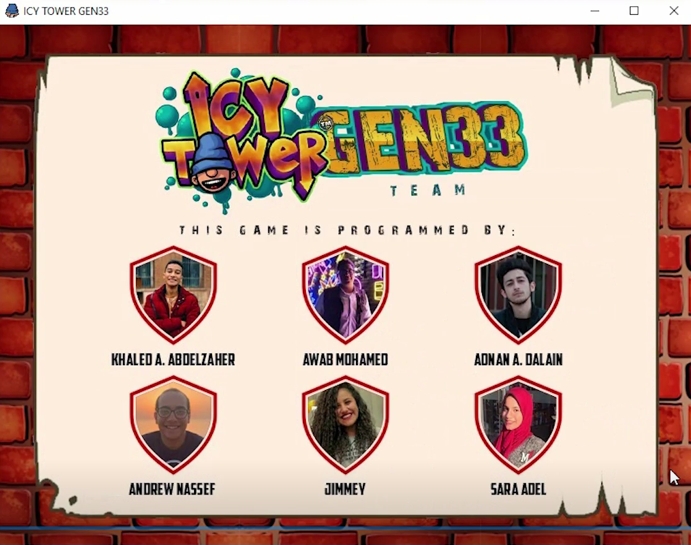
